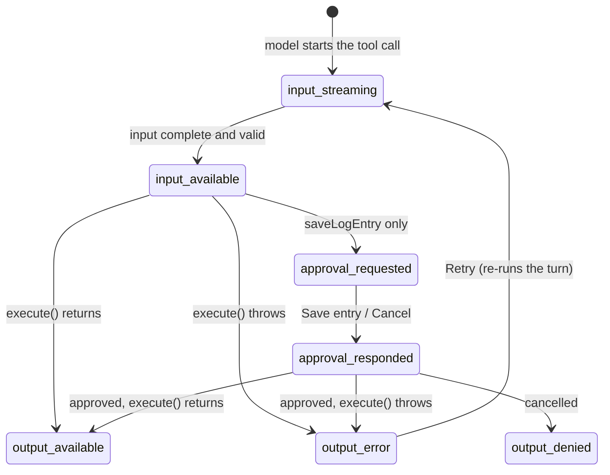

# DevLog Assistant: Tool Results as UI (FE-07)

The AI chat for my capstone project **DevLog** (a journal where developers log their daily work), now with **generative UI**: the assistant can call server-side tools, and their results show up as real components (a list of entries, a chart, a confirm card) instead of text or JSON.

This builds on the Week 4 streaming chat (`Week4_Task/Streaming_AI_Chat_Interface`). For this task I moved the chat from my own NDJSON stream to the **Vercel AI SDK v7** (`ai`, `@ai-sdk/react`), because typed tool parts, multi-step calls and tool approval all come from it.

---

## Objective

Show AI tool results as **structured UI instead of plain text**, and design every state a tool call goes through: loading, working, result, empty, error, and (for writes) confirmation.

## Features

- **Three server-side tools**: search logs, log stats, save an entry (with approval)
- **Results as components**: entry list, bar chart, saved-entry card; never raw JSON in the chat
- **Loading state**: skeleton + tool name in plain language, with parameters appearing as they stream
- **Working state**: query chips (dates, tag, keyword) + spinner
- **Error state**: designed error card with the reason, what was tried, and a **Retry** button
- **Empty state**: for searches with no results
- **Confirmation state**: Save / Cancel card showing exactly what will be saved
- **Smooth transitions** between states (one card that morphs), off for "reduce motion"
- **"Why this tool" hint**: "Chose queryLogs because you asked about last week"
- **State showcase page** at **`/states`**: every state side by side, and each tool's structured JSON next to the component it becomes
- Light / dark theme, responsive down to 375px, fully typed (no `any`)

## State showcase: `/states`

Open **http://localhost:3000/states** (or **Tool states** in the chat header). It shows:

1. **Transitions**: one card playing through its states. **Play success** goes loading → working → result; **Play error** ends in the error card.
2. For each tool: **Structured output** (the JSON the tool returns) next to **Rendered as** (the component the user sees).
3. Every other state of each tool, labeled with the SDK state name and the question it answers.

The cards are the same components the chat uses, fed sample data from [`components/tools/fixtures.ts`](components/tools/fixtures.ts). No API key needed.

---

## Try it (demo prompts)

Each prompt shows a different tool and its states. On an empty chat, the first three are also suggestion cards.

| Prompt | What you should see |
| --- | --- |
| `What did I work on last week?` | **queryLogs**: "Searching your logs…" with the date chip filling in → chips + spinner → a list of entries → a 1–3 sentence takeaway |
| `Show my react entries` | queryLogs filtered by tag (`#react` chip) |
| `Search my logs for "kubernetes"` | queryLogs **empty state** ("Nothing logged for this search") |
| `Chart my hours over the last 4 weeks` | **getLogStats**: totals, a bar chart (switch Entries / Hours, hover a bar), hours by tag, "View as table" |
| `Save this entry: fixed the flaky contribution graph test by pinning TZ=UTC in CI, testing, 2h` | **saveLogEntry**: the draft fills in field by field → "Save this entry to your DevLog?" → **Save entry** → "Saved", or **Cancel** → "Not saved" |
| `Search my logs for fail` | **Error state**: "Couldn't search your logs" card → **Retry** runs it again and succeeds |
| Open `/?simulateToolError=1`, then ask anything that uses a tool | Every tool fails → error card → **Retry** succeeds (retry switches simulation off) |

> With a real model (Gemini), the tool input often arrives in one chunk, so "input-streaming" only flashes. To watch every state slowly, run locally with `CHAT_PROVIDER=mock` (see [Run it](#run-it-on-your-computer)).

---

## Tools

All tools live in [`lib/ai/tools.ts`](lib/ai/tools.ts) and run **on the server** (`execute`). The route ([`app/api/chat/route.ts`](app/api/chat/route.ts)) passes them to `streamText` with `stopWhen: isStepCount(5)`, so after a tool returns, the model is called again to answer with the result.

Every tool also accepts an optional **`reason`** (string, ≤120 chars): a short phrase the model writes for the user, shown as *"Chose queryLogs because you asked about last week"*. If the model leaves it out, the UI builds a hint from the other inputs.

### `queryLogs`

Search the user's entries. Read-only, **no confirmation**.

| Field | Type | Required | Description | When missing, the UI shows… |
| --- | --- | --- | --- | --- |
| `from` | `YYYY-MM-DD` | no | Earliest entry date (inclusive) | "All time" chip (with `to`: "Until Sep 28") |
| `to` | `YYYY-MM-DD` | no | Latest entry date (inclusive) | "Since Sep 22" chip, or "All time" |
| `tag` | string | no | One lower-case tag, e.g. `react` | no tag chip |
| `keyword` | string | no | Text to find in titles and summaries | no keyword chip |

**Returns** `{ entries: { id, date, title, summary, tags, hoursSpent? }[], total }`: at most 20 entries, newest first. `total` counts all matches, so the card can say "Showing the 20 newest of 34". An entry with no `hoursSpent` shows a muted "—" (not "0h").

**Errors:** `from` after `to` → "The start date (…) is after the end date (…)". Rendered by **LogResultsCard** ([`components/tools/QueryLogsTool.tsx`](components/tools/QueryLogsTool.tsx)).

### `getLogStats`

Totals for a chart. Read-only, **no confirmation**.

| Field | Type | Required | Description | Default when missing |
| --- | --- | --- | --- | --- |
| `from` | `YYYY-MM-DD` | no | First day to include | 27 days before `to` (4 weeks); chip says "Last 4 weeks" |
| `to` | `YYYY-MM-DD` | no | Last day to include | today |
| `groupBy` | `"day"` \| `"week"` | no | Bucket size for the timeline | `day` for ≤14 days, else `week`; chip says "Auto grouping" |

**Returns** `{ from, to, groupBy, buckets: { start, end, entries, hours }[], hoursByTag: { tag, hours }[] (top 6), totalEntries, totalHours, entriesWithoutHours }`. The actual `from`/`to`/`groupBy` used are returned, so the UI never guesses. `groupBy: "day"` over more than 31 days falls back to weeks, since that many bars can't be read.

**Errors:** `from` after `to`; ranges over one year. Rendered by **LogStatsCard** ([`components/tools/LogStatsTool.tsx`](components/tools/LogStatsTool.tsx)): a hand-rolled SVG bar chart plus tag bars and a table view.

### `saveLogEntry`

Write a new entry. **Needs confirmation**: the route sets `toolApproval: { saveLogEntry: "user-approval" }` (the AI SDK v7 replacement for `needsApproval`), so `execute` only runs after the user clicks **Save entry**.

| Field | Type | Required | Description | When missing |
| --- | --- | --- | --- | --- |
| `title` | string, 3–80 | **yes** | Short headline | — |
| `summary` | string, 3–280 | **yes** | One or two sentences in the user's words | — |
| `tags` | string[], ≤5 | **yes** | Lower-case tags; `[]` if none fit | card shows "No tags" |
| `date` | `YYYY-MM-DD` | no | Day the work happened | saved as today; card shows "Today" |
| `hoursSpent` | number, 0.25–24 | no | Only if the user said it | card shows "Not tracked"; never guessed |

**Returns** `{ entry: { id, date, title, summary, tags, hoursSpent? } }`: the stored entry, with the real date and id. Rendered by **SaveEntryTool** ([`components/tools/SaveEntryTool.tsx`](components/tools/SaveEntryTool.tsx)). If the user cancels, the part ends in `output-denied` and the model is told not to retry.

### Data

There's no database yet. Entries come from [`lib/devlog/entries.ts`](lib/devlog/entries.ts): 27 sample entries over the last 5 weeks, with dates **relative to today**, so "last week" always has data. Saved entries live in **server memory**: they're there while the server is warm and reset on a cold start or redeploy. A short fake delay (`DEVLOG_TOOL_LATENCY_MS`, default 700ms) stands in for a database round-trip, so the "working" state is visible.

### Error behaviour

- A tool throws **`ToolFailure`** with a message written for the user.
- The SDK masks tool errors by default. The route's `onError` (`publicErrorMessage`) passes `ToolFailure` messages through and replaces everything else with a safe sentence (API key rejected, rate limited, provider down, …). **No stack traces reach the browser.**
- The failed part arrives as `output-error` with that `errorText`, and the model sees the error too, so it says plainly that the lookup failed.
- The error card shows a friendly headline, the reason, **what was attempted** (the same chips), and **Retry**. Retry re-runs the turn with `toolErrorMode: "off"`.

**How to trigger it (for review):**

| Trigger | Effect |
| --- | --- |
| Keyword **`fail`** (`queryLogs` keyword or `saveLogEntry` title equal to "fail") | That call throws |
| **`?simulateToolError=1`** in the page URL | Every tool call throws |
| **Retry** button | Re-runs with simulation off |

### Tool part states

Each state answers a different question, so each one looks different. It is **one card** that stays mounted and morphs between them: the border and colors transition, the height animates to the new content (~200ms), and the new body fades in. With "reduce motion" on, the change is instant.

| State | Question it answers | What the card shows |
| --- | --- | --- |
| `input-streaming` | What is it doing? | Dashed border, shimmering "Searching your logs…", chips appearing as parameters stream, skeleton rows |
| `input-available` | With what input? | Solid border, spinner, the final chips (date range, tag, keyword) |
| `output-available` | What came back? | The real component: entry list / chart / saved entry |
| `output-error` | What went wrong? | Red card: friendly headline, reason, "What I tried" chips, Retry |

`saveLogEntry` adds the approval states: `approval-requested` (confirm card with **Save entry** / **Cancel**), `approval-responded` ("Saving your entry" or "Cancelled") and `output-denied` ("Not saved").



### Type safety

`DevLogUIMessage = UIMessage<DevLogMetadata, UIDataTypes, InferUITools<DevLogTools>>` ([`lib/chat/types.ts`](lib/chat/types.ts)). Every `tool-queryLogs` / `tool-getLogStats` / `tool-saveLogEntry` part has typed `input` and `output`, and each component switches on `part.state` exhaustively. The server validates incoming history against the same schemas (`safeValidateUIMessages`). There's no `any`.

---

## Where to find things

| What | File |
| --- | --- |
| **Tools** (the deliverable) | [`lib/ai/tools.ts`](lib/ai/tools.ts) |
| Route handler: `streamText`, approval, error masking | [`app/api/chat/route.ts`](app/api/chat/route.ts) |
| Provider choice, generation settings, system prompt | [`lib/ai/config.ts`](lib/ai/config.ts) |
| Scripted mock model (no API key needed) | [`lib/ai/mock.ts`](lib/ai/mock.ts) |
| Sample entries (in-memory store) | [`lib/devlog/entries.ts`](lib/devlog/entries.ts) |
| `useChat` + persistence + error switch | [`lib/chat/use-devlog-chat.ts`](lib/chat/use-devlog-chat.ts) |
| Shared card shell, morph animation, chips, error body | [`components/tools/ToolCard.tsx`](components/tools/ToolCard.tsx) |
| One component per tool (state switch inside) | [`components/tools/`](components/tools/) |
| Message rendering (text and tool cards in order) | [`components/chat/Message.tsx`](components/chat/Message.tsx) |
| State showcase page and its sample data | [`app/states/page.tsx`](app/states/page.tsx), [`components/tools/StatesGallery.tsx`](components/tools/StatesGallery.tsx), [`components/tools/fixtures.ts`](components/tools/fixtures.ts) |

---

## Which AI does it use?

| Setting in `.env.local` | AI used |
| --- | --- |
| `ANTHROPIC_API_KEY` | **Claude** via `@ai-sdk/anthropic` |
| `GEMINI_API_KEY` | **Google Gemini** via `@ai-sdk/google` (free tier) |
| no key (local only) | The **mock** model |
| `CHAT_PROVIDER=mock` / `gemini` / `anthropic` | Forces one of the above |

The mock speaks the AI SDK's model protocol, so tool execution, approvals and the UI stream are the real code paths. Only the "thinking" is keyword rules. It streams tool inputs slowly, so every state is easy to see.

---

## Run it on your computer

```bash
npm install
```

```bash
cp .env.example .env.local
```

Add `GEMINI_API_KEY` (free at https://aistudio.google.com/apikey), or add `CHAT_PROVIDER=mock` to demo without a key. Then:

```bash
npm run dev
```

Open http://localhost:3000.

## Put it online (Vercel)

Set **Root Directory** to `Week5_Task/Tool_results_and_structured_output_in_the_UI` and add `GEMINI_API_KEY` (or `ANTHROPIC_API_KEY`) under Environment Variables.

---

## Learning outcomes

- Defining tools with small, honest Zod schemas (`.describe()` on every field) and a plan for every missing optional field
- Rendering typed tool parts (`tool-*`) by state instead of dumping JSON
- Designing loading, empty, error and confirmation states as separate answers to separate user questions
- Human-in-the-loop writes with `toolApproval`
- Surfacing errors safely: readable messages through `onError`, no stack traces
- End-to-end type safety with `InferUITools` and `UIMessage` generics

---

## Tech used

Next.js 16 (App Router) · React 19 · Tailwind CSS v4 · Vercel AI SDK v7 (`ai`, `@ai-sdk/react`, `@ai-sdk/anthropic`, `@ai-sdk/google`) · Zod 4 · `streamdown`
