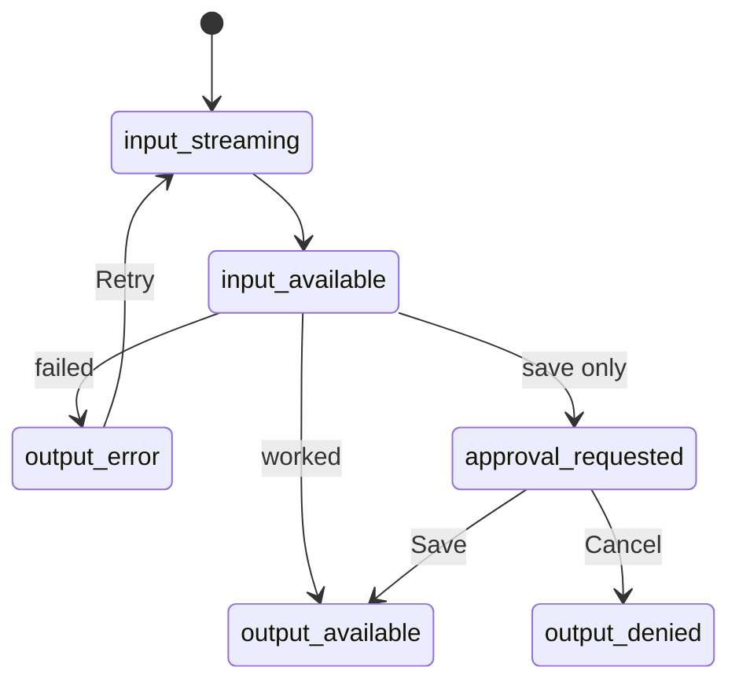

# DevLog Assistant: Tool Results

An AI chat for **DevLog** (a daily work journal for developers).

The AI can use **tools** (like "search my logs"). The results show as **cards** (a list, a chart, a save form), not plain text.

---

## Run it

```bash
npm install
```

```bash
cp .env.example .env.local
```

In `.env.local`, add **one** of these:

- `GEMINI_API_KEY=your-key` → real AI (free key: https://aistudio.google.com/apikey)
- `CHAT_PROVIDER=mock` → fake AI (no key needed)

```bash
npm run dev
```

Open http://localhost:3000

---

## Try it

| Type this | You see |
| --- | --- |
| `What did I work on last week?` | List of entries |
| `Chart my hours over the last 4 weeks` | Bar chart |
| `Save this entry: fixed a bug, testing, 2h` | Save / Cancel card |
| `Search my logs for "kubernetes"` | "Nothing found" card |
| `Search my logs for fail` | Error card → click **Retry** |

- Open `/?simulateToolError=1` → every tool fails.
- Open `/states` → all cards on one page.

---

## Tools

File: [`lib/ai/tools.ts`](lib/ai/tools.ts)

| Tool | What it does | Inputs (all optional unless marked) | Asks first? |
| --- | --- | --- | --- |
| `queryLogs` | Search entries | `from`, `to` (dates), `tag`, `keyword` | No |
| `getLogStats` | Numbers for a chart | `from`, `to`, `groupBy` (`day` / `week`) | No |
| `saveLogEntry` | Save a new entry | `title`*, `summary`*, `tags`*, `date`, `hoursSpent` | **Yes** |

\* = required

**What they return:**
- `queryLogs` → `{ entries, total }` (max 20 entries)
- `getLogStats` → entries and hours per day/week, hours per tag, totals
- `saveLogEntry` → the saved entry

**If an input is missing:** no dates → "All time", no hours → "Not tracked", no tags → "No tags", no date → today.

**Errors:** the tool sends a friendly message. The card shows the reason and a **Retry** button. There are no scary technical errors.

**Data:** 27 sample entries (no database). Saved entries are lost when the server restarts.

---

## Card states

| State | Shows |
| --- | --- |
| `input-streaming` | "Searching your logs…" (loading) |
| `input-available` | Search details + spinner |
| `output-available` | The result card |
| `output-error` | Error message + Retry |

The save tool also has: **Save / Cancel** → **Saving** → **Saved** or **Not saved**.



---

## Tech

Next.js 16 · React 19 · Tailwind CSS · Vercel AI SDK · Zod
