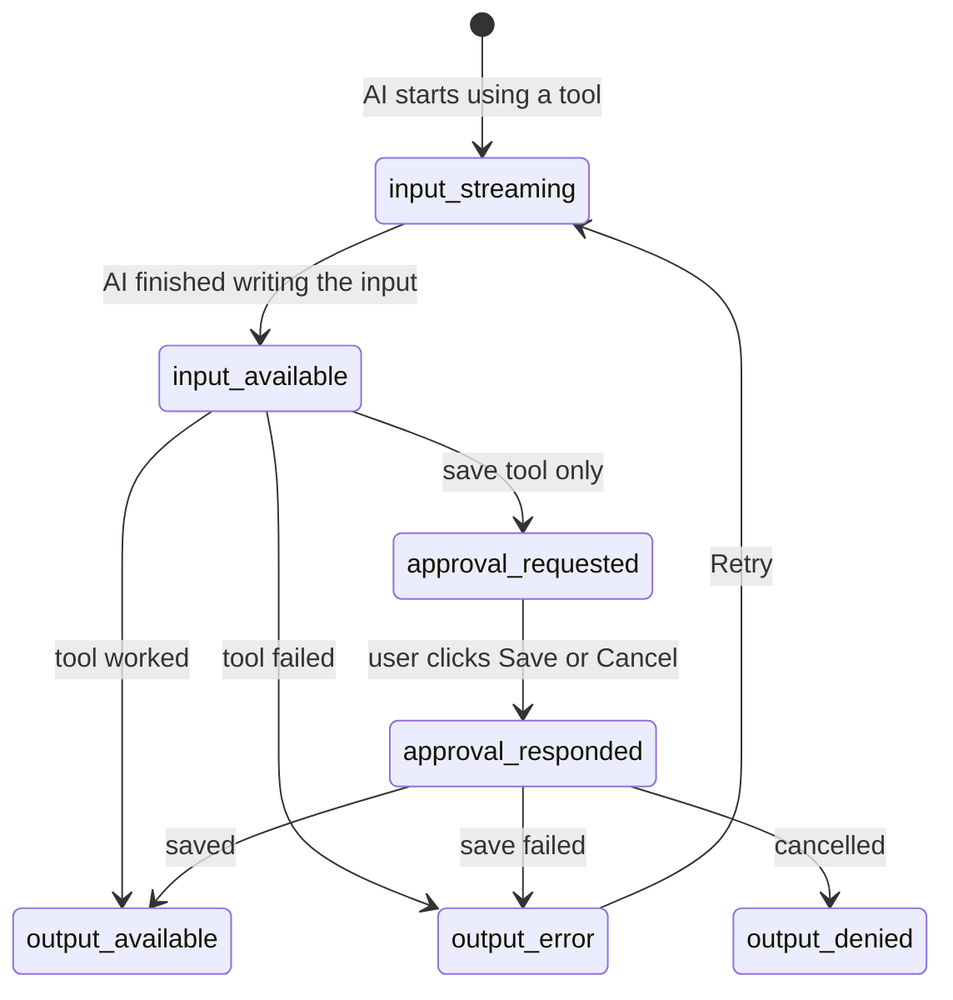

# DevLog Assistant: Tool Results in the UI (FE-07)

This is the AI chat for my project **DevLog**. DevLog is a journal where developers write what they worked on each day.

In this task, the AI can now **use tools**. A tool is a small function on the server, for example "search my logs". When the AI uses a tool, the answer is shown as a **real card** (a list, a chart, a form), not as plain text or JSON.

I built this on top of my Week 4 chat. I also moved the chat to the **Vercel AI SDK**, because it has built-in support for tools.

---

## Goal

- Show tool results as nice UI cards, not as text.
- Design every step of a tool call: **loading**, **working**, **result**, **empty**, **error**, and **asking for permission**.

## Features

- **3 tools**: search logs, show stats (chart), save a new entry
- **Results as cards**: a list of entries, a bar chart, a "saved" card
- **Loading card**: shows what the AI is doing ("Searching your logs…")
- **Working card**: shows what the AI is searching for (dates, tag, keyword) with a spinner
- **Error card**: a friendly message, what was tried, and a **Retry** button
- **Empty card**: when a search finds nothing
- **Permission card**: before saving, you see the entry and click **Save** or **Cancel**
- **Smooth animation** when a card changes from one step to the next
- **"Why this tool"** line, for example: "Chose queryLogs because you asked about last week"
- **Showcase page** (`/states`) that shows all cards on one screen
- Light and dark theme, works on phones

---

## How to run

1. Install packages:

   ```bash
   npm install
   ```

2. Make your settings file:

   ```bash
   cp .env.example .env.local
   ```

3. Open `.env.local` and choose one:
   - `GEMINI_API_KEY=your-key` to use real AI (free key: https://aistudio.google.com/apikey)
   - `CHAT_PROVIDER=mock` to use a fake AI (no key, no cost, good for demos)

4. Start the app:

   ```bash
   npm run dev
   ```

5. Open http://localhost:3000

> If you change `.env.local`, stop the app (`Ctrl + C`) and run `npm run dev` again.

---

## Try these messages

Type these in the chat:

| Type this | What you will see |
| --- | --- |
| `What did I work on last week?` | A list of last week's entries |
| `Show my react entries` | Entries with the `#react` tag |
| `Search my logs for "kubernetes"` | The empty card (nothing found) |
| `Chart my hours over the last 4 weeks` | A bar chart and hours per tag |
| `Save this entry: fixed the flaky test by pinning TZ=UTC in CI, testing, 2h` | A permission card. Click **Save entry** or **Cancel** |
| `Search my logs for fail` | The error card. Click **Retry** and it works |

To make **every** tool fail, open http://localhost:3000/?simulateToolError=1

> **Tip:** Real AI (Gemini) is very fast, so you may not see the loading card. Use `CHAT_PROVIDER=mock` to see every step slowly.

---

## Showcase page (`/states`)

Open http://localhost:3000/states (or click **Tool states** at the top of the chat).

On this page you can see:

1. **Transitions**: click **Play success** or **Play error** to watch one card go through all its steps.
2. **Structured output**: the JSON data each tool returns, next to the card it becomes.
3. **All states**: every card, with a label.

It uses sample data, so you don't need an API key.

---

## The tools

The tools are in [`lib/ai/tools.ts`](lib/ai/tools.ts). They run on the **server**.

Every tool can also get a `reason` from the AI. This is the short text in "Chose queryLogs **because you asked about last week**". If the AI doesn't send it, the app makes its own.

### 1. `queryLogs`: search entries

Finds your entries. It only reads, so it **does not ask for permission**.

| Input | Type | Required? | What it means | If not given |
| --- | --- | --- | --- | --- |
| `from` | date (`2026-09-21`) | No | Start date | No start limit (card shows "All time") |
| `to` | date | No | End date | Up to today |
| `tag` | text | No | One tag, like `react` | Any tag |
| `keyword` | text | No | A word to find in the title or summary | No word search |

**Gives back:** a list of up to 20 entries (newest first) and the total count.
Each entry has: `id`, `date`, `title`, `summary`, `tags`, and `hoursSpent` (can be empty; the card then shows "—").

**Can fail when:** the start date is after the end date.

### 2. `getLogStats`: numbers for a chart

Counts your entries and hours. It only reads, so it **does not ask for permission**.

| Input | Type | Required? | What it means | If not given |
| --- | --- | --- | --- | --- |
| `from` | date | No | Start date | 4 weeks before the end date |
| `to` | date | No | End date | Today |
| `groupBy` | `day` or `week` | No | One bar per day or per week | Days for short ranges, weeks for long ones |

**Gives back:** entries and hours for each day or week, the top 6 tags by hours, and the totals.

**Can fail when:** the start date is after the end date, or the range is longer than 1 year.

### 3. `saveLogEntry`: save a new entry

Saves a new entry. It changes data, so it **asks for permission first**. Nothing is saved until you click **Save entry**.

| Input | Type | Required? | What it means | If not given |
| --- | --- | --- | --- | --- |
| `title` | text (3–80 letters) | **Yes** | Short title | — |
| `summary` | text (3–280 letters) | **Yes** | One or two sentences | — |
| `tags` | list of text (max 5) | **Yes** | Tags like `testing` (can be empty) | Card shows "No tags" |
| `date` | date | No | The day of the work | Today |
| `hoursSpent` | number | No | Hours spent (only if you said it) | Card shows "Not tracked" |

**Gives back:** the saved entry, with its new `id`.

If you click **Cancel**, nothing is saved and the AI will not try again.

### Where the data comes from

There is no database yet. The app has **27 sample entries** from the last 5 weeks, in [`lib/devlog/entries.ts`](lib/devlog/entries.ts). The dates move with today's date, so "last week" always has data.

Entries you save are kept **in server memory**. They are lost when the server restarts.

---

## Errors

- When a tool fails, it sends a **friendly message** (not a scary technical error).
- The app never shows stack traces or secret details to the user.
- The error card shows: what went wrong, what the AI tried, and a **Retry** button.
- **Retry** runs the same request again with the test errors turned off, so it works.

**How to test the error card:**

| Do this | Result |
| --- | --- |
| Search for the word **`fail`** | That search fails |
| Open the page with **`?simulateToolError=1`** | Every tool fails |
| Click **Retry** | It runs again and works |

---

## The steps of a tool call

A tool call goes through steps. Each step answers a different question, so each step has its own card. It is **one card that changes**, with a short animation (turned off if your device has "reduce motion" on).

| Step (SDK name) | Question it answers | What you see |
| --- | --- | --- |
| `input-streaming` | What is the AI doing? | Dashed card, "Searching your logs…", search details appear one by one |
| `input-available` | What is it searching for? | Chips (dates, tag, keyword) and a spinner |
| `output-available` | What did it find? | The real card: list, chart, or saved entry |
| `output-error` | What went wrong? | Red card with the reason and **Retry** |

The save tool has 3 extra steps:
- `approval-requested`: "Save this entry?" with **Save entry** and **Cancel**
- `approval-responded`: "Saving your entry" (or "Cancelled")
- `output-denied`: "Not saved"



---

## Which AI does it use?

| In `.env.local` | AI used |
| --- | --- |
| `ANTHROPIC_API_KEY` | Claude |
| `GEMINI_API_KEY` | Google Gemini (free) |
| No key (on your computer) | Fake AI (mock) |
| `CHAT_PROVIDER=mock` | Always the fake AI |

The **fake AI** picks a tool by looking for words in your message (like "last week" or "save"). Everything else (the tools, the cards, the permission step) is the real code.

---

## Where to find things

| What | File |
| --- | --- |
| **The tools** (main file for this task) | [`lib/ai/tools.ts`](lib/ai/tools.ts) |
| Server route that talks to the AI | [`app/api/chat/route.ts`](app/api/chat/route.ts) |
| AI settings and instructions | [`lib/ai/config.ts`](lib/ai/config.ts) |
| Fake AI | [`lib/ai/mock.ts`](lib/ai/mock.ts) |
| Sample entries | [`lib/devlog/entries.ts`](lib/devlog/entries.ts) |
| Chat logic (sending, saving the chat) | [`lib/chat/use-devlog-chat.ts`](lib/chat/use-devlog-chat.ts) |
| Tool cards | [`components/tools/`](components/tools/) |
| Shared card design and animation | [`components/tools/ToolCard.tsx`](components/tools/ToolCard.tsx) |
| Showcase page | [`app/states/page.tsx`](app/states/page.tsx) |
| Chat messages | [`components/chat/Message.tsx`](components/chat/Message.tsx) |

---

## Put it online (Vercel)

1. Push the code to GitHub.
2. On Vercel, import the repo.
3. Set **Root Directory** to `Week5_Task/Tool_results_and_structured_output_in_the_UI`.
4. Add `GEMINI_API_KEY` in **Environment Variables**.
5. Click **Deploy**.

---

## What I learned

- How to make tools for an AI, with clear inputs
- How to show tool results as cards instead of text
- How to design loading, empty, error, and permission states
- How to ask the user before the AI changes data
- How to show friendly errors without leaking technical details
- How to keep everything typed with TypeScript (no `any`)

---

## Tech used

Next.js 16 · React 19 · Tailwind CSS v4 · Vercel AI SDK v7 · Zod 4 · Streamdown
